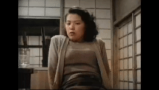

# Black and White to Color Movie Conversion

This project aims to colorize a black and white fragment of the movie "Ikiru" (1952) using deep learning techniques. The colorization is achieved through a Convolutional Neural Network (CNN) model pre-trained on a large dataset from Kaggle.




## Dataset and Pre-trained Models

The pre-trained models and related files were obtained from the Kaggle dataset:
[Colorize Image Dataset](https://www.kaggle.com/datasets/ashishpatel26/colorise-image)

## Project Structure

```plaintext
BNW2C-Movie/
├── .venv/                  # Virtual environment directory
├── frames/                 # Directory for extracted frames from the movie
├── movie/                  # Directory containing the original movie fragment
├── colorization_deploy_v2.prototxt  # Prototxt file for the CNN model
├── colorization_release_v2_norebal.caffemodel  # Pre-trained Caffe model
├── pts_in_hull.npy         # Numpy array with cluster centers for colorization
├── frame_extraction.py     # Script to extract frames from the movie
├── Model.py                # Main script to colorize the frames and recreate the movie
├── requirements.txt        # List of dependencies for the project
└── README.md               # This README file
